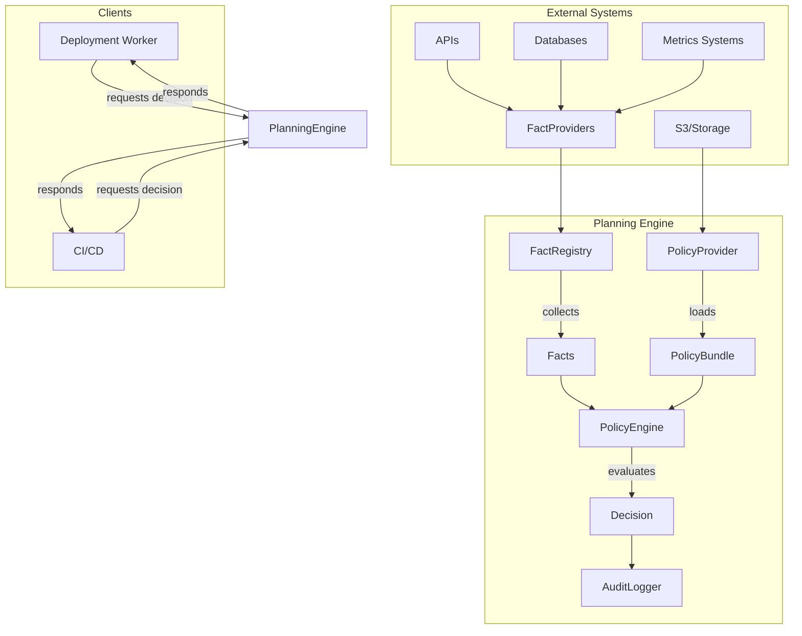

# Planning Engine

Planning Engine is a Go-based system for making and auditing automated
deployment decisions based on system state and policy rules. It evaluates facts
about the current system state against defined policies to determine if
deployments should proceed, providing a flexible and auditable decision-making
framework.

## Purpose

The Planning Engine serves as a centralized decision point that:

1. Collects facts about the system state
2. Evaluates those facts against defined policies
3. Makes allow/deny decisions for deployment operations
4. Audits and logs all decisions for traceability

This approach ensures consistent decision-making across deployments, removes
human error from routine decisions, and provides clear audit trails for all
deployment actions.

## Key Concepts

### Facts

Facts represent point-in-time data about the system state. Each Fact has:

- **ID**: Unique identifier (e.g., "pending_delta")
- **Value**: The actual data point
- **Timestamp**: When the fact was collected

Facts are collected by FactProviders that can fetch data from various sources
(databases, APIs, metrics systems, etc.).

### FactRegistry

The FactRegistry orchestrates fact collection by:

- Maintaining a catalog of registered FactProviders
- Collecting facts from all providers when requested
- Creating snapshots of the system state for policy evaluation

### PolicyEngine

The PolicyEngine evaluates facts against policies to produce Decisions. The
default implementation uses Open Policy Agent (OPA) for policy evaluation.
Policies are written in Rego language and define rules for allowing or denying
operations.

### Decision

A Decision represents the outcome of policy evaluation:

- **Allow**: Boolean indicating if the operation is permitted
- **DenyReasons**: Array of human-readable reasons when denied

### AuditLogger

The AuditLogger persists all decisions and errors for traceability, supporting:

- Successful decision logs with input facts and outcomes
- System error logs for failures during the decision process

## System Architecture



The Planning Engine provides decisions to client systems (like CI/CD pipelines or deployment
workers) which then execute the actual deployment actions.

## Getting Started

### Prerequisites

- Go 1.24 or higher
- [OPA](https://www.openpolicyagent.org/) for policy evaluation

### Installation

```bash
# Clone the repository
git clone https://github.com/asimihsan/planning_engine.git
cd planning_engine

# Install dependencies
go mod download
```

### Running Tests

```bash
# Run unit tests
go test ./pkg/... ./internal/...

# Run integration tests
go test ./tests/integration/...
```

### Usage Example

```go
// Create components
registry := gate.NewFactRegistry()
engine := opa.NewEngine()
policyProvider := file.New("policy/main.rego", "data.gate.response")
logger := stdout.New()

// Register fact providers
registry.Register(myFactProvider)

// Get policy bundle
policyBundle, err := policyProvider.GetPolicyBundle(ctx)
if err != nil {
    // Handle error
}

// Collect facts
facts, err := registry.Snapshot(ctx, "deployment-123", "production")
if err != nil {
    // Handle error
}

// Evaluate policy
decision, err := engine.Evaluate(ctx, policyBundle, facts)
if err != nil {
    // Handle error
}

// Log decision
logger.LogDecision(ctx, facts, decision, policyBundle.ID(), "config-version", evalDuration)

// Act on decision
if decision.Allow {
    // Proceed with deployment
} else {
    // Abort deployment and return reasons
    fmt.Println("Deployment denied:", decision.DenyReasons)
}
```

## Current Status

**Milestone 1 Complete**: Core functionality is implemented, including:

- Basic fact collection with synchronous provider execution
- Simple policy evaluation using OPA
- In-memory fact registry
- File-based policy provider
- Console-based audit logging
- Integration tests for basic scenarios

## Next Steps

### Milestone 2: Enhanced Fact Collection

- Parallel fact collection with error group synchronization
- Fact staleness policies with TTL configuration
- Support for lazy-loading and caching of facts
- More built-in fact providers for common data sources

### Milestone 3: Advanced Policy Management

- Dynamic policy reloading
- Policy versioning and rollback
- Policy testing framework
- Rule coverage analysis tools

### Milestone 4: Production Hardening

- Persistent audit logging with database integration
- Prometheus metrics for decision performance
- Distributed caching for facts
- Enhanced security and access controls

## Contributing

Contributions are welcome! Please feel free to submit a Pull Request.

## License

[MIT License](LICENSE)
