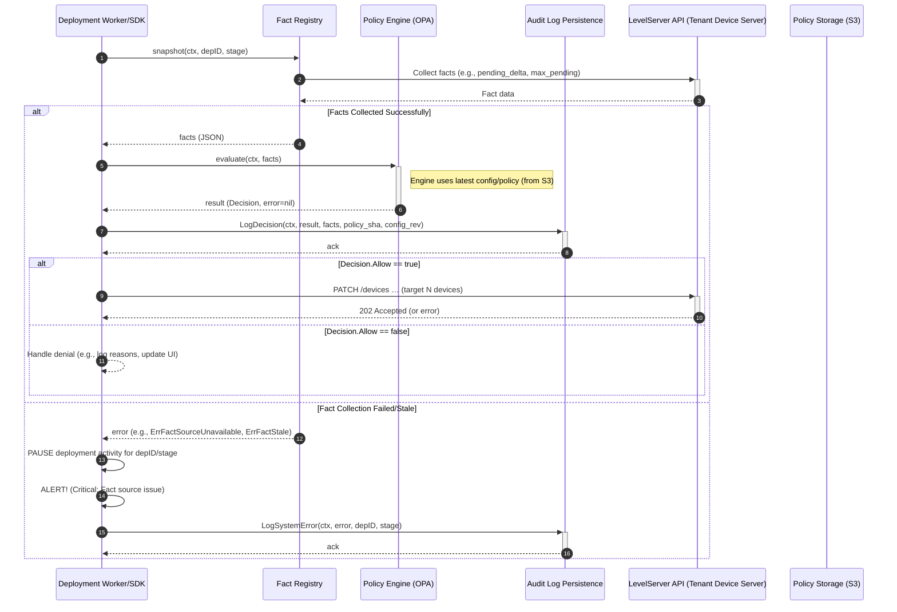

**Deployment-Engine Gate – Software Design Document (v0.2 / Apr 25 2025)**

**1. Problem Statement**

Frequent firmware rollouts require balancing deployment velocity (delivering business value) with operational safety (avoiding device issues like bricking, preventing customer-support spikes, and protecting backend services from overload). Existing ad-hoc deployment scripts and manual checks lack guarantees, making it difficult to:

* Enforce dynamic safety limits consistently (e.g., maximum number of devices concurrently updating, rate of new devices starting updates).
* Provide clear, auditable reasons when a deployment action is automatically blocked.
* Adapt safety rules and thresholds at runtime without requiring code changes and redeployments.

We need a deterministic, runtime-configurable gate component that evaluates the current system state against defined policies to answer the question: “Is it safe to target N more devices for this deployment stage right now?”. This decision must be auditable, recording the facts and policy configuration used.

**2. Goals**

* **Safety:** Reliably enforce operator-defined safety limits based on real-time system state. Prevent exceeding configured thresholds (e.g., `max_pending`, `pending_delta`).
* **Extensibility (Open/Closed Principle):** Allow adding new *facts* (data sources) and *rules* (policy logic) with minimal or no modification to the core engine or existing fact providers. The system should be open for extension but closed for modification.
* **Explainability:** Every decision (allow or deny) should be accompanied by the context used (facts, config/policy version) and, for denials, machine-readable reasons derived from the policy evaluation.
* **Runtime Adaptability:** Allow the gate to dynamically pick up new policy bundles and configuration changes (e.g., updated limits) within a short timeframe (target: ~60 seconds) without requiring restarts or service interruption.
* **Testability:** Ensure high confidence through comprehensive testing:
    * Unit tests for individual components, especially `FactProvider` implementations.
    * Policy rules validated independently (`opa test` or similar).
    * Integration tests simulating real-world interactions (e.g., fetching policies from S3, writing audit logs to DynamoDB) potentially using tools like LocalStack.
    * Maintain high test coverage (target: ≥ 95%).
* **Maintainability:** Design clear interfaces and components that are easy to understand, modify, and operate.

**3. High-Level Flow**



**4. User Stories**

* **(Safety/Mutability)** SRE Paige responds to an incident by lowering the `pending_delta` limit in the configuration repository. Within a minute, the gate picks up the change and starts blocking deployment batches larger than the new limit.
* **(Testability)** QA Dana uses a test utility (`gate-cli --dry-run --facts=local_facts.json --policy=./policy/bundle.tar.gz`) to verify that a planned rollout configuration passes against current (or simulated) system facts before the actual rollout starts.
* **(Explainability/Audit)** Support Lee investigates why a specific deployment stage stalled. Lee queries the Audit Log (e.g., in DynamoDB/Loki) using the `deploymentID` and finds decision records showing denials with reasons like `"max_pending limit exceeded: current 3100 > configured 2000"`.
* **(Extensibility)** Developer Ravi needs to add a new safety check based on recent device crash rates. Ravi implements a new `CrashRateProvider` struct satisfying the `FactProvider` interface, registers it with the `FactRegistry` at startup, and updates the Rego policy to use the new `crash_rate` fact. No changes are needed in the core `DecisionEngine` or other `FactProviders`.

**5. Key Design Decisions**

* **Fact-Centric Architecture:** Inspired by declarative systems like Datalog, the core input is a collection of independent "facts" about the system state. Each fact is self-contained (ID, value, source). This makes adding new data points straightforward.
* **Interface-Driven Design:** Define clear Go interfaces (`FactProvider`, `PolicyProvider`, `AuditLogger`) to decouple components, enabling independent implementation, testing (using mocks/stubs), and dependency injection.
* **Fact Registry Pattern:** A central registry discovers and invokes registered `FactProvider` implementations. This supports the Open/Closed Principle: new providers can be added without modifying the registry's core logic. The registry orchestrates parallel fact collection.
* **Schema-Driven Validation:** The policy bundle includes a schema (`input.json`) defining the expected fact structure. The policy engine (e.g., OPA) should validate incoming fact sets against this schema, ensuring required data is present.
* **Policy Engine:** Utilize Open Policy Agent (OPA) with Rego policies for expressive, decoupled rule definition and evaluation.
* **Policy Provider Abstraction:** Abstract policy loading (`PolicyProvider` interface) to support different sources (e.g., `file://` for local testing, `s3://` for production) with potential for future enhancements like signature verification.
* **Fail-Safe on Critical Errors:** If essential system facts cannot be reliably retrieved (e.g., `LevelServer` unavailable, data clearly stale beyond acceptable limits), the gate signals a system error. The calling component (Worker/SDK) **must** interpret this as a signal to **pause** affected deployment activities and **alert** operators, rather than proceeding or simply denying based on potentially invalid data. Policy evaluation errors should also lead to pause/alert.
* **Deterministic Audit Log:** Every decision attempt (successful evaluation, fact error, evaluation error) is logged with immutable context: `policy_sha`, `config_rev`, input `facts` (or error details), and the resulting `Decision` or system error. This provides crucial traceability.

**6. Detailed Architecture**

* **6.1 Components**
    * **`FactProvider` (interface):** Defines the contract for supplying a piece of system state.
        * `Collect(ctx context.Context, depID, stage string) (Fact, error)`: Fetches/calculates the fact value. Should handle internal caching and staleness checks. Return specific errors for unavailable/stale data.
        * `Describe() registry.Schema`: Provides metadata, including the Fact `ID` and potentially its JSON schema definition.
    * **`Fact` (interface/struct):** Represents a single piece of data.
        * `ID() string`: Unique identifier (e.g., `"pending_delta"`).
        * `Value() any`: The actual data point.
    * **`FactRegistry`:**
        * Holds a map of `factID -> FactProvider`.
        * `Snapshot(ctx, depID, stage) (map[string]any, error)`: Invokes `Collect` on relevant providers (potentially in parallel), aggregates facts into a map suitable for OPA input. Returns an error if any critical provider fails or reports stale data.
    * **`PolicyProvider` (interface):** Responsible for loading and providing policy bundles.
        * `GetPolicyBundle(ctx context.Context) (PolicyBundle, error)`: Loads policy (e.g., from `file://` or `s3://`). Implementations handle polling/updates and ETag checks.
    * **`PolicyBundle` (struct):** Contains the compiled OPA policy, input schema, and metadata (e.g., SHA/version).
    * **`PolicyEngine` (e.g., OPA Wrapper):**
        * Takes the latest `PolicyBundle` and configuration snapshot.
        * `Evaluate(ctx context.Context, input map[string]any) (Decision, error)`: Evaluates the policy against the input facts. Returns `Decision` on success, or an error if evaluation fails.
    * **`Decision` (struct):** The output of a successful policy evaluation.
        * `Allow bool`: The primary outcome.
        * `DenyReasons []string`: Machine-readable explanations if `Allow == false`.
        * (Metadata like `PolicySHA`, `ConfigRev`, `EvalNS` can be added here or logged separately).
    * **`AuditLogger` (interface):** Defines how decisions and errors are persisted.
        * `LogDecision(ctx, DecisionInput, DecisionOutput, Metadata)`
        * `LogSystemError(ctx, error, Metadata)`
    * **`Deployment Worker/SDK`:** The client component that integrates the gate.
        * Calls `FactRegistry.Snapshot`.
        * Handles `Snapshot` errors (pause/alert).
        * Calls `PolicyEngine.Evaluate`.
        * Handles `Evaluate` errors (pause/alert).
        * Calls `AuditLogger`.
        * Acts on the `Decision` (proceed with deployment or handle denial).
        * Manages the dynamic loading/refreshing of configuration and policy via `PolicyProvider`.

* **6.2 Fact Implementations (Examples for v0.2 PoC)**
    * `pending_delta`: Source = `LevelServer` API (count of devices newly targeted but not yet confirmed active). Provider implements caching with TTL.
    * `max_pending`: Source = `LevelServer` API (total count of devices in transitional states for the deployment). Provider implements caching with TTL.
    * *(Future Example)* `crash_rate`: Source = Metrics System (e.g., Prometheus query, CloudWatch). Provider queries metrics API.

* **6.3 Configuration (PKL)**
    * Define static thresholds and system settings. PKL is chosen for its structure and ability to generate other formats like YAML if needed by downstream tools.
    * ```pkl
        # Gate configuration
        limits = {
          # Default hard limits evaluated in policy
          maxDelta = 500
          maxPending = 2000
          # Example: Could add minRuntimeHours = 24.0 later
        }

        # Settings for providers and engine
        policy = {
          # Target S3 for PoC integration tests
          bundleURI = "s3://my-deployment-gate-policies/policy/bundle.tar.gz"
          # How often to check for new policy/config
          refreshInterval = "30s"
        }

        factProviders = {
          levelServerBaseURL = "http://levelserver.internal:8080"
          # Cache TTL for LevelServer facts
          cacheTTL = "15s"
          # Max staleness before erroring
          maxStaleness = "45s"
        }

        audit = {
          # Target DynamoDB for PoC integration tests
          logTarget = "dynamodb" # or "stdout" for local dev
          dynamoTableName = "DeploymentGateAuditLog"
        }

        prometheus = {
          listenAddr = ":9100" # For exposing internal metrics
        }
        ```

* **6.4 Audit Log Store (DynamoDB Example for PoC)**
    * Table Name: `DeploymentGateAuditLog`
    * Primary Key: `Partition Key = deploymentID#stage`, `Sort Key = timestamp (ISO8601)`
    * Attributes: `decisionID (UUID)`, `policySHA`, `configRev`, `factsJSON`, `outcome (allow|deny|error)`, `reasonsJSON` (if deny), `errorDetails` (if error), `evalDurationNS`.

**7. API Definitions (Go Interfaces - Conceptual)**

```go
package gate

import (
	"context"
	"time"
)

// Fact represents a single piece of data about the system state.
type Fact interface {
	ID() string // e.g., "pending_delta"
	Value() any
}

// Schema provides metadata about a Fact or input structure.
type Schema struct {
	ID          string
	Description string
	// Could include JSON schema definition here
}

// FactProvider fetches or calculates a specific Fact.
type FactProvider interface {
	Describe() Schema
	// Collect fetches the fact. It should handle caching and staleness internally.
	// Returns specific error types for critical failures (e.g., ErrStale, ErrSourceUnavailable).
	Collect(ctx context.Context, deploymentID, stage string) (Fact, error)
}

// PolicyBundle holds the compiled policy and metadata.
type PolicyBundle interface {
	ID() string // e.g., SHA or version
	// GetCompiledPolicy() returns the engine-specific policy object
	// GetInputSchema() returns the expected input schema
}

// PolicyProvider retrieves PolicyBundles.
type PolicyProvider interface {
	// GetPolicyBundle fetches the current policy bundle (e.g., from S3).
	// Implementations handle polling/updates.
	GetPolicyBundle(ctx context.Context) (PolicyBundle, error)
}

// Decision represents the outcome of a policy evaluation.
type Decision struct {
	Allow       bool
	DenyReasons []string
	// Other metadata can be added if needed directly here
}

// PolicyEngine evaluates facts against a policy.
type PolicyEngine interface {
	// Evaluate runs the policy against the input facts.
	// Returns the Decision on success.
	// Returns an error for evaluation failures (distinct from fact collection errors).
	Evaluate(ctx context.Context, policy PolicyBundle, input map[string]any) (Decision, error)
}

// AuditLogger persists decision and error information.
type AuditLogger interface {
	LogDecision(ctx context.Context, input map[string]any, decision Decision, policyID, configID string, evalDuration time.Duration) error
	LogSystemError(ctx context.Context, systemError error, deploymentID, stage, policyID, configID string) error
}

// Standard error types
var (
	ErrFactSourceUnavailable = errors.New("fact source unavailable")
	ErrFactStale             = errors.New("fact data is stale")
	// ... other specific errors
)

```

**8. Security Considerations**

* **Policy Bundle Integrity:** The S3 `PolicyProvider` implementation **must** verify the integrity of downloaded bundles (e.g., using SHA256 checksums provided alongside the bundle). Future: Consider code signing for bundles.
* **Configuration Integrity:** Configuration (PKL files) should be managed in source control (e.g., Git) with appropriate access controls and review processes (e.g., CODEOWNERS).
* **Fact Collection Auth:** `FactProvider` implementations interacting with external services (like `LevelServer`, metrics APIs) must use secure credentials (e.g., IAM roles assumed via workload identity) with the principle of least privilege (read-only access to necessary data).
* **Audit Log Sensitivity:** Ensure audit logs (especially `factsJSON`) do not contain sensitive device-specific identifiers (e.g., PII, MAC addresses). Log only necessary aggregates and metadata. Access to the audit log store (DynamoDB) should be restricted.
* **Denial of Service:** Malformed policies or inputs could cause high CPU usage in the policy engine. Implement timeouts and resource limits around policy evaluation. Ensure fact collection has reasonable timeouts to prevent hanging.

**9. Open Questions & Next Steps**

* **PoC Implementation Plan:**
    * Define core interfaces (`FactProvider`, `PolicyProvider`, `AuditLogger`, `PolicyEngine`).
    * Implement `FactRegistry`.
    * Implement basic `FactProvider` for `pending_delta`, `max_pending` (initially using mock data, then potentially hitting LocalStack `LevelServer` mock).
    * Implement `file://` and `s3://` `PolicyProvider` (using LocalStack for S3).
    * Implement `stdout` and `dynamodb` `AuditLogger` (using LocalStack for DDB).
    * Wrap OPA Go SDK for `PolicyEngine`.
    * Develop initial Rego policy and `input.json` schema.
    * Build simple `Worker/SDK` simulation or CLI tool.
    * Set up integration tests using Go testing framework + LocalStack.
* **Detailed Error Handling:** Define specific error types/codes for different failure modes (fact stale, fact source down, policy eval error, config load error) and how the Worker/SDK should react to each.
* **Staleness Definition:** How is "too stale" defined for facts? Is it just based on cache TTL expiry + grace period, or failed refresh attempts? Needs clear logic in providers.
* **Audit Log Schema:** Finalize the DynamoDB schema details. What GSI/LSIs might be needed for common query patterns?
* **Schema Pipeline:** Revisit the idea of auto-extracting required fact IDs during bundle build to fail CI when a provider is missing for a required fact in the policy.
* **Hot Reload Atomicity:** Refine the mechanism for atomically swapping `PolicyBundle` and related `Configuration` snapshots within the engine/SDK to prevent inconsistencies during updates.
* **Metrics:** Define key Prometheus metrics: eval latency histogram, decisions counter (allow/deny by reason), errors counter (fact/eval/system), policy/config reload counter.
* **CLI vs gRPC Service:** Defer final decision post-PoC, but design interfaces assuming either could be built on top. The PoC will likely use the library approach initially.
